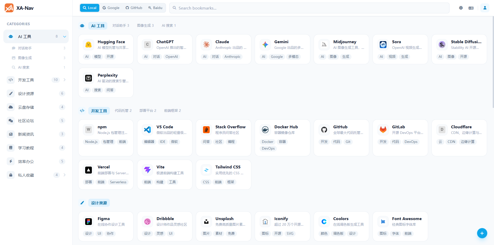
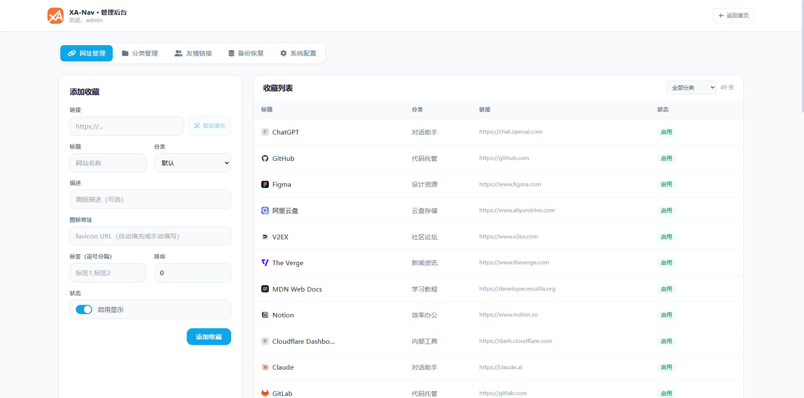

中文 | [English](README_en.md)

# XA Nav

XA Nav 是一个基于 React、Vite、Cloudflare Pages Functions 和 Cloudflare D1 的书签导航页面，支持公开导航、管理员后台、智能填充、友情链接、备份恢复和多语言界面。

作者博客：[https://www.xiaoa.me](https://www.xiaoa.me)

如果项目对你有所帮助，麻烦给个 `Star` ⭐。





## 功能特性

- 首页支持站内搜索、外部搜索、分类侧边栏、父子分类 Tab 和网址卡片展示
- 管理员登录后，首页右下角显示快捷添加收藏按钮，可直接弹窗添加网址并智能填充站点信息
- 后台支持网址管理、分类管理、友情链接管理、系统配置和备份恢复
- 分类支持 Font Awesome 图标、排序、父子级和私密分类
- 私密分类仅管理员登录后显示，未登录用户不会获取私密分类及其网址
- 友情链接支持站点名、图标、描述、URL、排序和启用状态，并在首页底部展示
- 登录支持图片验证码和 Cloudflare Turnstile
- 登录 Cookie 有效期可在后台按小时配置
- 网站名称、Logo URL、页脚版权、默认语言和 Favicon API 接口前缀可在后台配置
- 网址智能填充会优先保存网站自身图标；未获取到图标时留空，显示时使用 Favicon API 前缀拼接域名
- 可通过后台开关启用 Workers AI，在无法获取描述或标签时自动生成 Meta 信息，默认关闭
- 支持 JSON 备份导入导出
- 支持浏览器书签 HTML 文件导入导出
- 支持中文和英文界面

## 技术栈

- 前端：React 18、React Router、Vite、Tailwind CSS
- 后端：Cloudflare Pages Functions
- 数据库：Cloudflare D1
- 可选能力：Cloudflare Turnstile、Workers AI

## 本地开发

### 1. 安装依赖

```bash
npm install
```

### 2. 启动前端开发服务器

```bash
npm run dev
```

前端默认地址：

```text
http://localhost:5173
```

Vite 已配置 `/api` 代理到 Cloudflare Pages Functions 本地服务：

```text
http://localhost:8788
```

### 3. 启动 Cloudflare Pages Functions 本地服务

Cloudflare Pages Functions 需要通过 Wrangler 启动。建议先构建前端，再启动 Pages dev：

```bash
npm run build
npx wrangler pages dev dist --port 8788
```

接口地址示例：

```text
http://localhost:8788/api/categories
```

前端访问 `/api/*` 时会由 Vite 代理到该服务。

如果修改了 [functions/](functions/) 下的后端接口代码，建议重启 Wrangler Pages dev，避免旧进程继续提供旧逻辑。

### 4. 初始化 D1 数据库

先使用 [db/schema.sql](db/schema.sql) 创建 D1 表结构。表结构存在后，应用在首次读取系统配置或分类时会自动写入默认配置和默认分类。

```bash
npx wrangler d1 execute xa-nav-db --local --file db/schema.sql
```

默认管理员账号来自环境变量，未配置时为：

```text
账号：admin
密码：admin123
```

### 3. 导入示例数据

```bash
npx wrangler d1 execute xa-nav-db --local --file db/seed.sql
```

## 构建

```bash
npm run build
```

构建产物输出到：

```text
dist
```

本地预览构建产物：

```bash
npm run preview
```

## Cloudflare Pages 部署

### 1. Fork本项目
`Fock` 本项目同时请帮忙点个 `Star` ⭐

### 2. 创建 D1 数据库

在 Cloudflare 控制台创建 D1 数据库，例如：

```text
xa-nav-db
```
*或* 脚本创建：
```bash
# 创建 D1 数据库
wrangler d1 create xa-nav-db
```

### 3: 导入数据表结构
手动复制 `db/schema.sql` (*4张表*) 在 D1 数据库控制台导入 
*或* 脚本导入：
```bash
# 使用架构和默认数据初始化数据库
wrangler d1 execute xa-nav-db --file=db/schema.sql
```

### 4. Cloudflare Pages 构建配置
1. 前往 **Cloudflare 控制台** > **Workers和Pages** > **创建应用程序** > **想要部署 Pages？开始使用**
2. 连接你的 Git 仓库
3. 配置 **构建设置**：
   - **框架预设**: `None`
   - **构建命令**: `npm run build`
   - **构建输出目录**: `dist`（当前目录）
   - **根目录**: `/`（仓库根目录）

### 5. 配置环境变量
1. 前往 **Cloudflare 控制台** > **Workers和Pages** > **xa-nav**
2. 前往 **设置** > **变量和密钥** 
- `ADMIN_USER`：后台管理员账号，未配置时为 `admin`
- `ADMIN_PASSWORD`：后台管理员密码，未配置时为 `admin123`
- `AUTH_SECRET`：(可选)登录 Cookie 和图片验证码签名密钥
3. 前往 **设置** > **绑定** 
4. 添加 **D1数据库**：
   - **变量名**: `db`
   - **D1 数据库**: `xa-nav-db`
5. (可选)添加 **Workers AI**:
   - **变量名**: `AI`
5. 导航到 **部署** > **所有部署**，最新的部署... `重试部署`（d1数据库绑定后必须重新部署）


## 系统配置说明

后台“系统配置”中可维护：

- 网站名称
- 网站描述
- Logo URL
- 页脚版权
- 默认语言
- 登录 Cookie 有效期（小时）
- 图片验证码开关
- Cloudflare Turnstile 开关、Site Key、Secret Key
- Favicon API 接口前缀
- AI 获取 Meta 开关

说明：

- Turnstile Site Key 和 Secret Key 在后台维护，Secret Key 不会在配置接口中明文返回
- 未完整配置 Turnstile 时，登录页不会显示 Turnstile，也不会强制验证 Turnstile
- Logo URL 留空时使用构建内置默认 Logo
- Favicon API 前缀会直接拼接去掉协议后的域名，例如：

```text
https://faviconsnap.com/api/favicon?url= + www.v2ex.com
https://icon.horse/icon/ + www.v2ex.com
```

- “启用 AI 获取 Meta”默认关闭；开启后也会优先使用网站自身 Meta，只有描述或标签获取不到时才调用 Workers AI

## D1 表结构

主要数据表：

- `config`：平台配置项，包含站点标题、Logo、页脚版权、Favicon API、AI Meta 开关、验证码、Turnstile、默认语言等
- `categories`：分类目录，支持父级子分类、默认分类、私密分类和 Font Awesome 图标
- `bookmarks`：网址书签，支持 Favicon、排序、标签和启用状态
- `friend_links`：友情链接，支持站点图标、描述、URL、排序和启用状态

## 常用命令

```bash
# 安装依赖
npm install

# 启动 Vite 前端
npm run dev

# 构建前端
npm run build

# 本地预览构建产物
npm run preview

# 启动 Cloudflare Pages Functions 本地服务
npx wrangler pages dev dist --port 8788

# 如需测试远程 D1 / Workers AI 等 Cloudflare 资源
npx wrangler pages dev dist --port 8788 --remote
```

## 目录说明

```text
src/                 前端源码
src/pages/           页面组件
src/lib/             前端工具和国际化
src/images/          静态图片资源
functions/           Cloudflare Pages Functions 接口
functions/api/       API 路由
functions/lib/       后端公共工具
```
